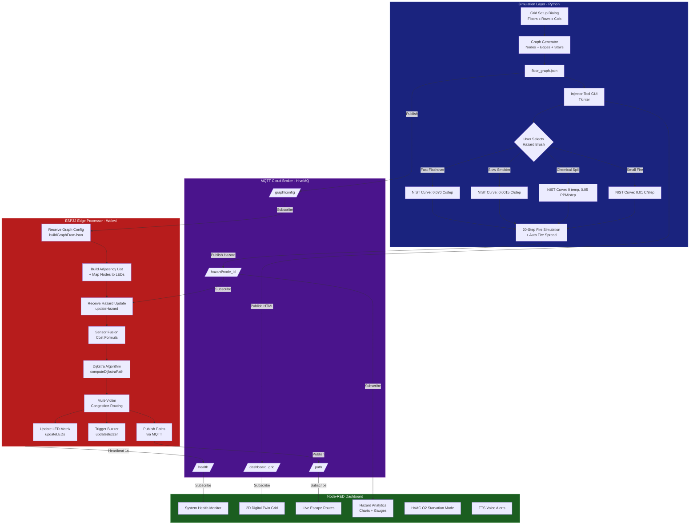
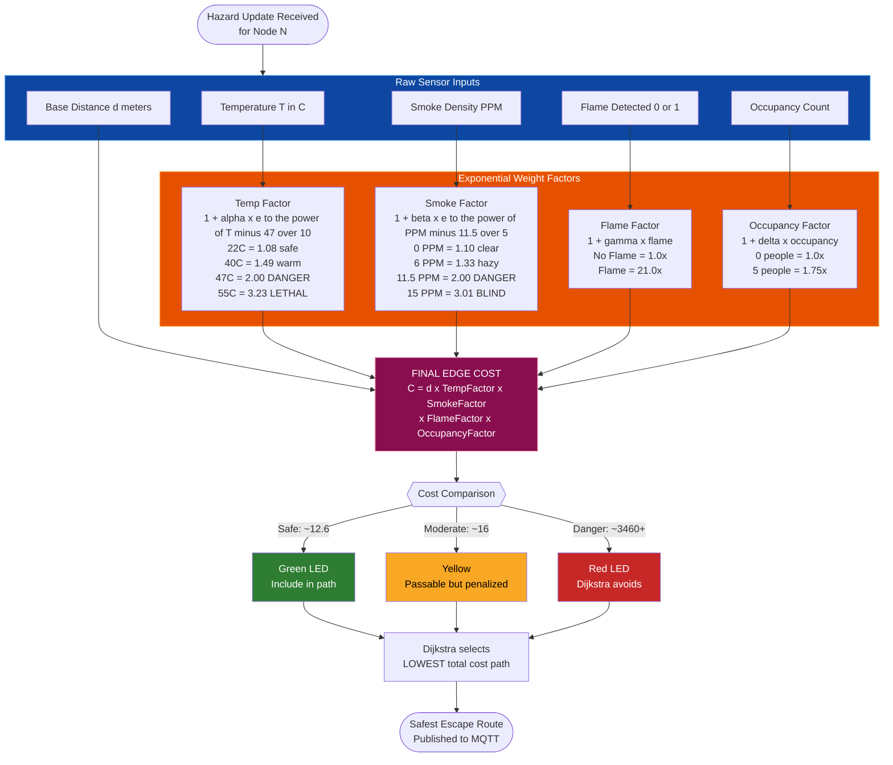
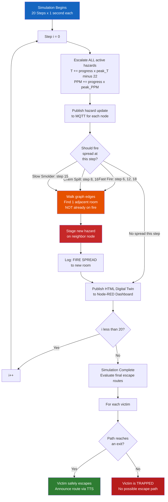
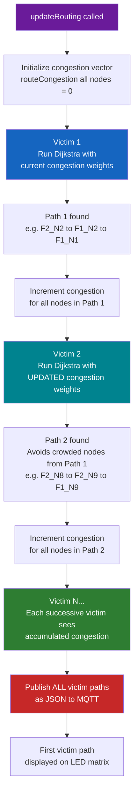

# Fire Commander — Engineering Flowcharts

These 6 flowcharts cover the entire logic of the Fire Commander system. You can copy the code blocks below and paste them into [mermaid.live](https://mermaid.live/) to generate high-quality images for your PPT and report.

---

## 1. Complete System Architecture

---

## 2. Sensor Fusion Cost Formula (⭐ KEY ENGINEERING DIAGRAM)

---

## 3. ESP32 Main Loop

```mermaid
flowchart TD
    BOOT["ESP32 Boot"] --> WIFI["Connect WiFi\nWokwi-GUEST"]
    WIFI --> MQTT_CONN["Connect MQTT\nbroker.hivemq.com"]
    MQTT_CONN --> SUB["Subscribe to\nhazard/# + graph/config"]
    SUB --> WAIT["Wait for Graph Config\ngraphReady = false"]

    WAIT -->|"Graph JSON received"| BUILD["buildGraphFromJson\nParse nodes, edges, exits"]
    BUILD --> INIT_PATH["Initial Dijkstra\ncomputeDijkstraPath"]
    INIT_PATH --> LOOP

    LOOP["loop start"] --> MQTT_LOOP["mqttClient.loop\nProcess incoming messages"]
    MQTT_LOOP --> HEARTBEAT{"1 second\nelapsed?"}
    HEARTBEAT -->|Yes| PUB_HEALTH["Publish health heartbeat\nstatus ONLINE uptime"]
    HEARTBEAT -->|No| SERIAL_CHECK
    PUB_HEALTH --> SERIAL_CHECK

    SERIAL_CHECK{"Serial data\navailable?"}
    SERIAL_CHECK -->|"Yes: N,idx,T,ppm,F,O"| SERIAL_PARSE["Parse serial injection\nupdateHazard"]
    SERIAL_CHECK -->|No| HAZARD_CHECK
    SERIAL_PARSE --> HAZARD_CHECK

    HAZARD_CHECK{"hazardChanged\n== true?"}
    HAZARD_CHECK -->|Yes| REROUTE["updateRouting\nRe-run Dijkstra for ALL victims\nPublish new paths via MQTT"]
    HAZARD_CHECK -->|No| LED
    REROUTE --> LED

    LED["updateLEDs\nDraw floor boundaries\nColor nodes by hazard state\nOverlay green path"]
    LED --> BUZZER["updateBuzzer\nSingle beep if hazard on path"]
    BUZZER --> DELAY["delay 10ms\nYield to RTOS"]
    DELAY --> LOOP

    style BOOT fill:#1565c0,color:#fff
    style LOOP fill:#6a1b9a,color:#fff
    style REROUTE fill:#c62828,color:#fff
    style LED fill:#2e7d32,color:#fff
    style BUZZER fill:#e65100,color:#fff
```

---

## 4. Fire Spread Prediction

---

## 5. Fail-Safe Mechanisms

```mermaid
flowchart TD
    subgraph HEARTBEAT["Heartbeat Monitor"]
        H1["ESP32 publishes\nstatus ONLINE\nevery 1 second"] --> H2{"Node-RED:\nHeartbeat received\nwithin 5 seconds?"}
        H2 -->|Yes| H3["Status: ONLINE\nGreen indicator"]
        H2 -->|No| H4["Status: OFFLINE\nSignal Lost warning"]
    end

    subgraph CORRUPT["Corrupted Payload Handling"]
        C1["MQTT message\narrives on ESP32"] --> C2{"JSON parse\nsuccessful?"}
        C2 -->|No| C3["Log warning\nSilently reject\nSystem continues"]
        C2 -->|Yes| C4{"Contains\nnode_id field?"}
        C4 -->|No| C5["Log: missing node_id\nSilently reject"]
        C4 -->|Yes| C6{"node_id exists\nin graph?"}
        C6 -->|No| C7["Log: unrecognized\nnode_id - reject"]
        C6 -->|Yes| C8["Process\nhazard update"]
    end

    subgraph TRAPPED_DETECT["Trapped Victim Detection"]
        T1["Dijkstra runs\nfor victim node"] --> T2{"Any exit\nreachable?"}
        T2 -->|Yes| T3["Return path\nUpdate LEDs green"]
        T2 -->|No| T4["Return empty path\nVictim declared TRAPPED"]
    end

    subgraph BUZZER_SAFE["Non-Blocking Buzzer"]
        B1{"Hazard detected\non path?"}
        B1 -->|"Yes first time"| B2["Single 500ms beep\ntone 1000Hz 500ms"]
        B1 -->|"Yes already beeped"| B3["Silent - no repeat"]
        B1 -->|"No path clear"| B4["Reset buzzer state"]
    end

    style HEARTBEAT fill:#1b5e20,color:#fff,stroke:#a5d6a7
    style CORRUPT fill:#0d47a1,color:#fff,stroke:#42a5f5
    style TRAPPED_DETECT fill:#b71c1c,color:#fff,stroke:#ef9a9a
    style BUZZER_SAFE fill:#e65100,color:#fff,stroke:#ffb74d
```

---

## 6. Multi-Victim Congestion Routing

